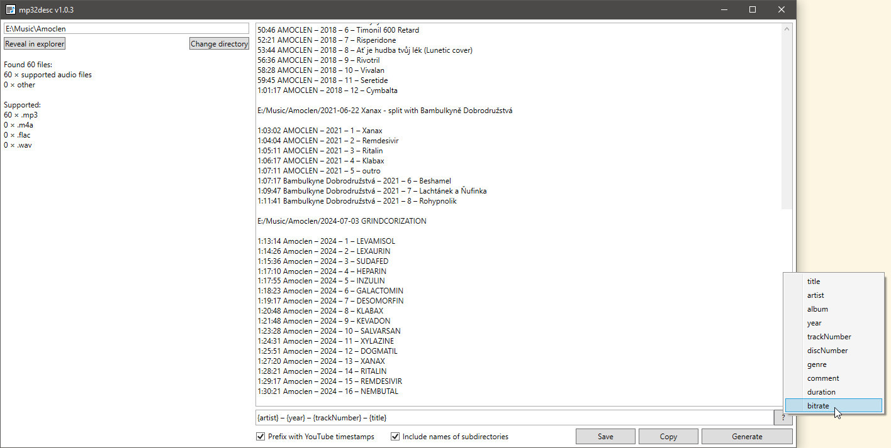

# mp32desc

Creates text summaries for collections of your mp3 (or other audio) files.

## Screenshot

## Changelog

### 1.0.3

* _Reveal in explorer_ button improvements/fixes
  * Can now open paths with commas in them
  * If there is a window with this path already opened, don't open it again and just focus the existing one
* Added app icon

### 1.0.2

* Show which and how many unsupported/non-audio files were not loaded
* Explicit file order by their full path (ascending) (instead of implicit `Directory.EnumerateFiles` order)

### 1.0.1

* Inform user if selected directory is empty

### 1.0.0

* Initial release

---

Uses [Zeugma440/atldotnet](https://github.com/Zeugma440/atldotnet) under [MIT license](https://github.com/Zeugma440/atldotnet/blob/main/LICENSE).
